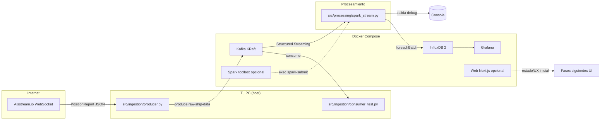

# Recorrido de arquitectura (Canary Maritime Monitor)

Este documento resume **qué piezas hay**, **cómo fluyen los datos** y **qué leer primero** si te sientes perdido entre Docker, Kafka, ingestión Python y Spark.

---

## Vista rápida del flujo de datos

**Leyenda corta**

- **Fase 2 (ingestión)**: `producer.py` traduce el stream AIS en mensajes Kafka en el topic `raw-ship-data`.
- **Fase 3 (procesamiento)**: `spark_stream.py` lee ese topic, parsea JSON, normaliza campos, aplica **bbox** de Canarias y añade **Haversine** al puerto más cercano (`nearest_port_nm`, `nearest_port_name`).
- **InfluxDB / Grafana**: Spark ya puede persistir en InfluxDB (`SPARK_OUTPUT_MODE=influx|both`) y Grafana se auto-provisiona con datasource + dashboard inicial.
- **Web**: existe base Next.js/Tailwind en `src/web/ui` para iterar UI y APIs.

---

## Puertos y “¿a qué me conecto?”

| Servicio   | Puerto host (típico) | Uso principal |
|-----------|----------------------|----------------|
| Kafka (externo) | `9092` | Clientes en el **host** (`127.0.0.1:9092`): producer, consumer, Spark si ejecutas en máquina local. |
| Kafka (interno Docker) | — | Dentro de la red Docker: **`kafka:19092`** (listener PLAINTEXT para tráfico entre contenedores). |
| InfluxDB  | `8086` | API HTTP del OSS 2.x (setup inicial con variables `DOCKER_INFLUXDB_*`). |
| Grafana   | `3000` | UI web (`GF_SECURITY_ADMIN_*`). |
| Web Next.js (opcional) | `3001` | Frontend base (`docker compose --profile web up web`). |

**Por qué hay dos direcciones para Kafka**

- El broker **anuncia** distintos “listeners” según quién conecte: desde fuera del Compose necesitas el host y el puerto mapeado; desde otro contenedor, el nombre DNS `kafka` y el puerto interno del listener.

---

## Mapa de carpetas y scripts “imprescindibles”

| Ruta | Rol |
|------|-----|
| `docker/docker-compose.yml` | Orquestación: Kafka (KRaft), InfluxDB, Grafana, servicios opcionales `spark` y `web`. |
| `docker/.env` / `docker/.env.example` | Versiones de imágenes, puertos, `KAFKA_CLUSTER_ID`, `KAFKA_BOOTSTRAP_SERVERS`, credenciales de laboratorio. |
| `docs/PROJECT_SPEC.md` | Bounding box de Canarias y visión del pipeline. |
| `src/ingestion/producer.py` | Entrypoint ingestión: arranca el bridge AISStream → Kafka. |
| `src/ingestion/core/*` | Config, WebSocket+reconexión, Kafka JSON, parsing de mensajes. |
| `src/ingestion/consumer_test.py` | Humo: lee `raw-ship-data` y muestra MMSI/nombre. |
| `src/processing/spark_stream.py` | Entrypoint Spark Streaming: Kafka → JSON → normalización → bbox → Haversine/puerto → consola. |
| `src/processing/core/*` | Config Spark, sesión, schema AIS, transformaciones, geo y puertos. |
| `src/storage/influx_smoke_test.py` | Verificación rápida de escritura en InfluxDB (últimos 15 min). |
| `src/web/ui` | Frontend base Next.js + Tailwind (Fase 4). |
| `src/ingestion/README.md` / `src/processing/README.md` | Comandos concretos de ejecución. |

Para el relato paso a paso y el “por qué” de cada decisión, ver **`docs/GUIA_DETALLADA_PIPELINE_ES.md`**.

---

## Rutas de aprendizaje

### En ~30 minutos (orientación)

1. Leer `docs/PROJECT_SPEC.md` (bbox y objetivo).
2. Abrir `docker/docker-compose.yml` y localizar solo: servicio `kafka`, `ports`, `KAFKA_ADVERTISED_LISTENERS`, servicio `spark` y volúmenes.
3. Abrir `src/ingestion/producer.py` y `src/processing/spark_stream.py` **sin entrar en core**: entiende el orden de llamadas (`load_config` → bridge / pipeline).
4. Mirar la tabla de puertos de arriba y memorizar: **host → `127.0.0.1:9092`**, **Docker → `kafka:19092`**.

### En ~2 horas (capacidad de explicar el sistema)

1. **`src/ingestion/core/config.py`**: cómo se cargan `repo/.env` y `docker/.env` y qué variables son obligatorias.
2. **`src/ingestion/core/aisstream_bridge.py`**: suscripción AISStream, filtro `PositionReport`, backoff de reconexión.
3. **`src/ingestion/core/kafka_client.py`**: productor/consumidor JSON simplificado.
4. **`src/processing/core/config.py`** y **`spark_session.py`**: master local, checkpoints, niveles de log.
5. **`src/processing/core/schema.py`** + **`transforms.py`** + **`geo.py`**: de `value` binario en Kafka a columnas planas, bbox y distancia al puerto más cercano.
6. Ejecutar mentalmente: producer → topic → Spark `readStream` → `writeStream` consola.

### En ~1 día (cómodo tocando código y Compose)

1. Levantar stack base + (opcional) Spark: ver comandos en `src/processing/README.md`.
2. Ejecutar producer y `consumer_test` hasta ver offsets crecer.
3. Ejecutar job Spark en contenedor con `spark-submit` y observar salida geocercada.
4. Experimentar: cambiar `startingOffsets` (solo en entornos desechables), revisar carpeta de checkpoint bajo `tmp/spark-checkpoints/`, revisar logs de Kafka si no hay mensajes.

---

## Checklist mental antes de depurar

- ¿Kafka estable (`docker compose ps`) y producer publicando?
- ¿`KAFKA_BOOTSTRAP_SERVERS` correcto para **dónde corre el cliente** (host vs contenedor)?
- ¿API key AISStream válida y bbox bien formado en la suscripción?
- ¿Spark con paquete `spark-sql-kafka` alineado a la versión de Spark y Ivy escribible (contenedor `spark`)?

Con esto deberías tener un **mapa cognitivo** del repo; la guía larga desarrolla cada script y decisión.
